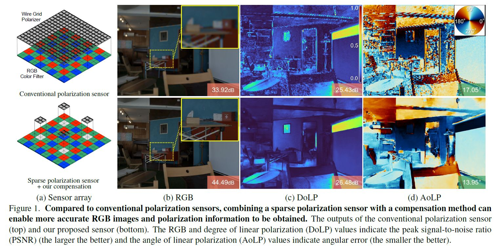
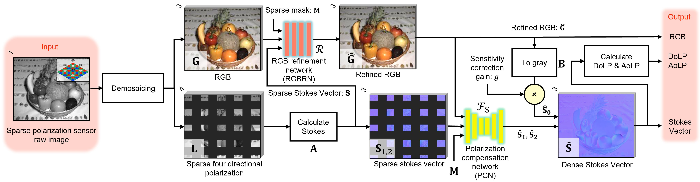
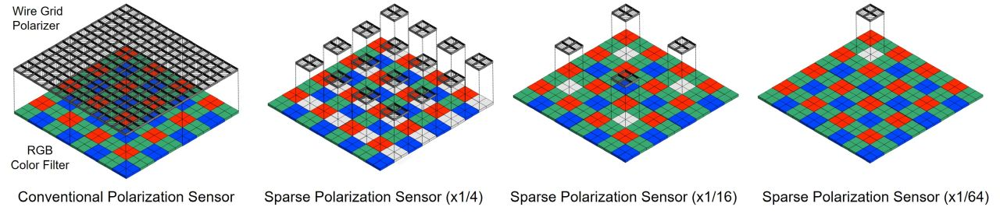

# Simultaneous Acquisition of High Quality RGB Image and Polarization Information using a Sparse Polarization Sensor (WACV 2023)
Teppei Kurita, Yuhi Kondo, Legong Sun and Yusuke Moriuchi\
Sony Group Corporation, Tokyo, Japan\
paper([arxiv](https://arxiv.org/abs/2209.13106)/cvf) | [dataset](#dataset)\


# SNA: Stokes Network Architecture
Code implementation regarding Simultaneous Acquisition of High Quality RGB Image and Polarization
Information using a Sparse Polarization Sensor (WACV2023).
This implementation is based on [PENet (ICRA2021)](https://github.com/JUGGHM/PENet_ICRA2021).



## Contents
1. [Dependency](#dependency)
0. [Dataset](#dataset)
0. [Directory structure](#directory-structure)
0. [Trained Models](#trained-models)
0. [Commands](#commands)
0. [License](#license)
0. [Citation](#citation)


## Dependency
Our released implementation is tested on.
+ Ubuntu 16.04
+ Python 3.7.4
+ PyTorch 1.8.1 / torchvision 0.9.1
+ NVIDIA CUDA 11.1.1
+ NVIDIA A100 GPU (Adjust batchsize according to the GPU memory)

Dependent libraries can be installed with the following commands, but full operation is not guaranteed.
It is recommended to create a Docker Image using the Dockerfile in this code.

```bash
pip install numpy matplotlib Pillow
pip install scikit-image
pip install opencv-contrib-python==4.5.2.54
```

## Dataset
[Real and Synthetic Polarization Dataset (RSP Dataset)](https://sonyjpn.sharepoint.com/sites/S168-RSPDataset)\
*Access to data requires a Microsoft account. After creating your Microsoft account, please contact [us](mailto:Teppei.Kurita@sony.com;Yuhi.Kondo@sony.com) with your Microsoft E-mail address to grant access. The access right is revoked after a certain period of time , and your account information is not retained.

## Trained Models
These models are trained on a richer full dataset than rsp-dataset.
The following four polarization sensor arrays are supported.

- [Conventional Polarization Sensor](https://sonyjpn.sharepoint.com/:u:/r/sites/S168-RSPDataset/Shared%20Documents/models/model_full_conv.tar?csf=1&web=1&e=7bJYnB)
- [Sparse Polarization Sensor (x1/4)](https://sonyjpn.sharepoint.com/:u:/r/sites/S168-RSPDataset/Shared%20Documents/models/model_full_x4.tar?csf=1&web=1&e=Z9zsGo)
- [Sparse Polarization Sensor (x1/16)](https://sonyjpn.sharepoint.com/:u:/r/sites/S168-RSPDataset/Shared%20Documents/models/model_full_x16.tar?csf=1&web=1&e=xwY4hI)
- [Sparse Polarization Sensor (x1/64)](https://sonyjpn.sharepoint.com/:u:/r/sites/S168-RSPDataset/Shared%20Documents/models/model_full_x64.tar?csf=1&web=1&e=ovgXqt)

*Access to data requires a Microsoft account. After creating your Microsoft account, please contact [us](mailto:Teppei.Kurita@sony.com;Yuhi.Kondo@sony.com) with your Microsoft E-mail address to grant access. The access right is revoked after a certain period of time , and your account information is not retained.

## Directory Structure
Example.
```
./polar-densification
./data/
    |- results
    |- rsp-dataset
      |- train_val
      |- eval
    |- models
      |- model_full_conv.tar
      |- model_full_x4.tar
      |- model_full_x16.tar
      |- model_full_x64.tar
```

## Commands
A complete list of training options is available with
```bash
python main.py -h
```
### Training
```bash
python main.py -b 5 -rp [conv,x4,x16,x64] --data-folder [data-folder-path] --gt-folder [gt-folder-path] --result [result-folder-path]
# -b for batch size
```
Example
```bash
python main.py -b 5 -rp x16 --data-folder ../data/rsp-dataset/train_val/x16/ --gt-folder ../data/rsp-dataset/train_val/gt/ --result ../data/results/
```

### Evalution
```bash
python main.py -b 1 -rp [conv,x4,x16,x64] --evaluate [checkpoint-path] --data-folder [data-folder-path] --gt-folder [gt-folder-path] --result [result-folder-path]
```

Example
```bash
python main.py -b 1 -rp x16 --evaluate ../data/models/model_full_x16.tar --data-folder ../data/rsp-dataset/train_val/x16/ --gt-folder ../data/rsp-dataset/train_val/gt/ --result ../data/results/
```

### Optional arguments:
```
  -h, --help            show this help message and exit

  # Parameter
  --raw-pattern {conv,x4,x16,x64}, -rp {conv,x4,x16,x64}
                        sensor raw pattern, [conv(entional)/x4/x16/x64]
                        (default: x16)
  --ps PS               polar pixel sensitivity (default: 0.35)

  # Network Parameter
  --refine-input N, -ri N
                        RGB refine input [0~7] (default: 6)
                        # - 0: Only RGB
                        # - 1: RGB and s0sps
                        # - 2: RGB and mask
                        # - 3: RGB and s12sps
                        # - 4: RGB and s0sps and mask
                        # - 5: RGB and s12sps and mask
                        # - 6: RGB and s012sps and mask (default)
                        # - 7: RGB and s012sps
  --refine-model N, -rm N
                        RGB refine model [0,1] (default: 0)
                        # - 0: RGB Refinement (default)
                        # - 1: No Refinement
  --comp-input-rgb N, -cir N
                        Polarizaiton compensation input (RGB) [0,1] (default:
                        1)
                        # - 0: RGB
                        # - 1: Refine RGB (default)
  --comp-input-extra N, -cie N
                        Polarization compensation input (extra) [0~3]
                        (default: 2)
                        # - 0: Only s12sps
                        # - 1: s12sps and s0sps
                        # - 2: s12sps and mask (default)
                        # - 3: s12sps and s0sps and mask
  --comp-model N, -cm N
                        Polarization compensation model [0,1] (default: 1)
                        # - 0: Our compensation model
                        # - 1: Our compensation model (w/ ATA&FTB) (default)
                        
  # Hyper Parameter
  --seed N, -se N       seed value. if -1, random seed (default: -1)
  --epochs N            number of total epochs to run (default: 30)
  --batch-size BATCH_SIZE, -b BATCH_SIZE
                        mini-batch size (default: 1)
  --lr LR, --learning-rate LR, -lr LR
                        initial learning rate (default 1e-3)
  --weight-decay W, -wd W
                        weight decay (default: 1e-6)
  --train-num TRAIN_NUM
                        the number of train data, 0 is all (default: 0)
  --train-random        random pickup for training data (default: false)
  --s0-8bit             s0 bit length precision (default: false)

  # Loss Function
  -c {l1_s12,l2_s12,l1,l2}, --criterion {l1_s12,l2_s12,l1,l2}
                        PCN loss function, l1 and l2 calculate s012 (default:
                        l1_S12)
  -crgb {l2,l1}, --rgb-criterion {l2,l1}
                        RGBRN loss function: (default: l2)
  --rank-metric {rmse,mse,mae,psnr}
                        metrics for which best result is saved (default: rmse)
  --rank-metric-domain {s12,s012}
                        domain of metrics for which best result is saved
                        (default: s012)

  # Paths
  --data-folder PATH    data folder (default: "../data/rsp_dataset/x16/")
  --gt-folder PATH      ground truth folder (default:
                        "../data/rsp_dataset/gt/")
  --result PATH         result folder (default: "../data/results/")
  --source-directory PATH
                        source code directory for backup (default: .)
  --suffix FN           suffix of result folder name (default: none)

  # Augmentation Parameter
  --not-random-crop     Prohibit random cropping (default: true)
  -he N, --random-crop-height N
                        random crop height (default: 576)
  -w N, --random-crop-width N
                        random crop height (default: 768)
  --jitter J            color jitter for images, only apply when s0 is 8bit
                        (default: 0.0)

  # Resume
  --resume PATH         path to latest checkpoint (default: none)
  --start-epoch N       manual epoch number, useful on restarts (default: 0)
  -ol, --optimizer-load
                        load optimizer when resumimg (default: false)
  --autoresume          auto resume from latest checkpoint (default: false)
  --bestresume          auto resume from best checkpoint (default: false)

  # Evaluation etc.
  -e PATH, --evaluate PATH
                        use existing models for evaluation (default: none)
  --print-freq N, -p N  print frequency (default: 10)
  --vis-skip N          skip of visualize comparison image (default: 0)
  --save-img-comp       save image comparison for each epoch (default: false)
  --eval-each           evaluation for each image (default: false)
  --save-interval N     save model interval (default: 1)
  --val-interval N      validation interval (default: 1)
  --train_eval          evaluate when training phase (default: false)
  --disp-all            output all results (default: false)
  --vis-dif             visualize diffuse component (default: false)
  --evalcomp_num N      number of the image for evaluation visualize (default:
                        120)

  # Debug
  --small               use small dataset (default: false)
  --small-rate SR       rate of small dataset, use with "small" argument
                        (default: 0.01)
  --s12gain S12GAIN     s12gain for visualize (default: 50.0)

  # Others
  --val-h N             validation height (default: 576)
  --val-w N             validation width (default: 768)
  --workers N           number of data loading workers (default: 4)
  --cpu                 run on cpu (default: false)
  --gpu N               GPU device, if -1, use parallel mode (default: -1)
```

# License
This software is released under the MIT License. See [LICENSE](LICENSE) for details.

# Citation
```
@InProceedings{Kurita_2023_WACV,
    author    = {Kurita, Teppei and Kondo, Yuhi and Sun, Legong and Moriuchi, Yusuke},
    title     = {Simultaneous Acquisition of High Quality RGB Image and Polarization},
    booktitle = {Proceedings of the IEEE/CVF Winter Conference on Applications of Computer Vision (WACV)},
    month     = {January},
    year      = {2023},
    pages     = {178-188}
}
```
